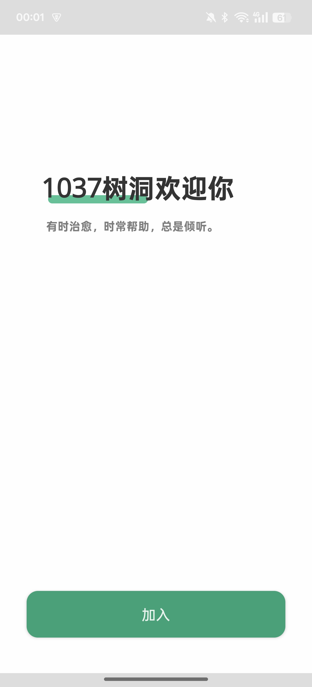
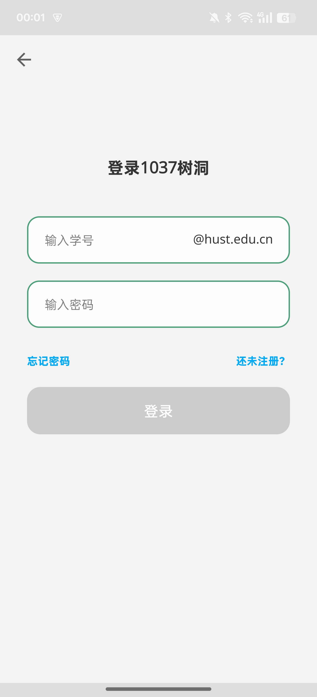
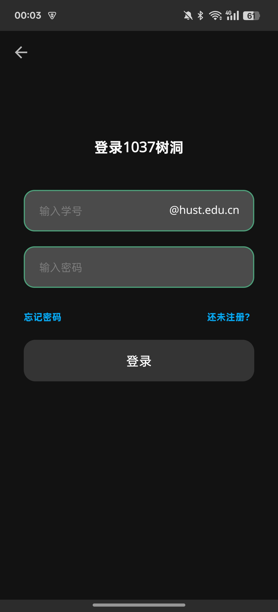

## 📢通知
华中科技大学1037项目在2023年前后停止活动，剩余仓库源码留存供学习使用

曾经的帖子存档，可以尝试复现后端
https://github.com/outaink/husthole-backup

## 📱截图

🌛黑暗模式支持

## TODO LIST
- [ ] ARouter（停止维护）迁移为Navigation
- [ ] 100% Kotlin
- [ ] 小树林模块删除，功能整合为Tag系统
- [ ] Jetpack Compose！
---
# HustHoleAndroid
华中科技大学校园匿名社交平台的Android应用。

## 开发语言
- Kotlin
- Java

## 技术框架
- RecyclerView: [官方文档](https://developer.android.com/guide/topics/ui/layout/recyclerview)
- ViewPager2 + Tablayout: [官方文档](https://developer.android.com/guide/navigation/navigation-swipe-view-2)
- WorkManager: [官方文档](https://developer.android.com/topic/libraries/architecture/workmanager)
- Navigation: [官方文档](https://developer.android.com/guide/navigation)
- ARouter: [Github仓库](https://github.com/alibaba/ARouter)
- Room: [官方文档](https://developer.android.com/training/data-storage/room)
- Retrofit: [Github仓库](https://github.com/square/retrofit)
- MMKV: [Github仓库](https://github.com/Tencent/MMKV)

## 技术特点
我们在开发中使用了组件化（Multi-Module）的开发方式，以及MVVM（Model-View-ViewModel）架构模式。关于这两种设计模式的学习和使用，你可以查看以下资源：

- [Multi-Module Apps](https://www.kodeco.com/real-world-android/8)
- [How to build a Modular Android App Architecture?](https://blog.mindorks.com/how-to-build-a-modular-android-app-architecture)
- [MVVM Architecture - Android Tutorial for Beginners](https://www.youtube.com/watch?v=TMHi9vNasUk)

### MVVM（Model-View-ViewModel）
MVVM架构模式是一种为用户界面提供数据支持并响应用户操作的设计模式。它分为三个主要部分：

- **Model**：包含应用程序数据和业务逻辑。它负责获取和保存应用程序数据，以及对数据进行处理和操作。Model 不直接与 View 或 ViewModel 交互，而是使用仓库模式提供数据。

- **View**：表示应用程序的用户界面。它负责显示数据（由 ViewModel 提供）并响应用户的操作，如点击和滑动事件。View 通过观察 ViewModel 中的 LiveData 对象来获取数据。

- **ViewModel**：充当 View 和 Model 之间的桥梁。它负责从 Model 获取数据并处理数据，以供 View 显示。ViewModel 不直接引用 View，而是通过 LiveData 提供数据，LiveData 是一个可观察的数据持有类，可以让 View 观察数据的变化。

## 新手入门学习Android
如果你是Android开发的新手，你可以按照以下学习路径进行学习：

- [Android基础入门](https://developer.android.com/courses/android-basics-kotlin/course)

